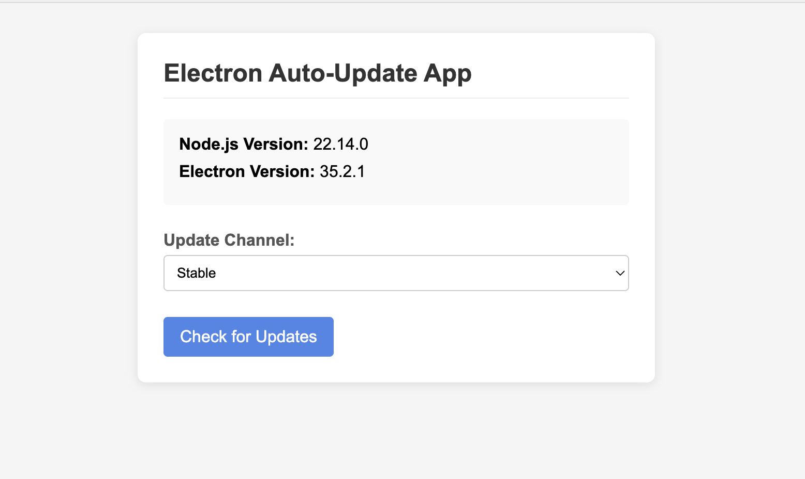

# Electron Auto-Update Example with AWS S3 and CloudFront

This repository provides a complete, working example of an Electron application configured for automatic updates using `electron-updater`. It demonstrates how to publish application releases to **AWS S3** and serve them efficiently via **AWS CloudFront**. This setup is ideal for developers looking to implement a robust and scalable auto-update mechanism for their Electron applications.



## Features

*   **Multi-Channel Updates:** Support for different release channels (stable, beta, dev).
*   **Real-time Progress:** Track update download progress within the application UI.
*   **Automatic Checks:** Configure automatic update checks on application startup.
*   **Manual Checks:** Provide a user interface option to manually check for updates.
*   **AWS Integration:** Leverage AWS S3 for storage and CloudFront for efficient content delivery.
*   **macOS Code Signing & Notarization:** Includes the necessary configuration for a complete macOS release process.
*   **Cross-Platform:** Designed to work across macOS, Windows, and Linux.
*   **Terraform Support:** Includes Terraform configurations for automating infrastructure setup.

## Alternative Providers

If AWS is not suitable for your needs, `electron-updater` supports other providers. Here are a couple of examples:

*   [Complete `electron-updater` HTTP example](https://gist.github.com/iffy/0ff845e8e3f59dbe7eaf2bf24443f104)
*   [Complete `electron-updater` from gitlab.com private repo example](https://gist.github.com/Slauta/5b2bcf9fa1f6f6a9443aa6b447bcae05)

## Prerequisites

Before you begin, ensure you have the following:

*   **Node.js and npm:** Installed on your development machine.
*   **An AWS Account:** You will need access to AWS S3 and CloudFront services. Basic familiarity with these services is helpful.
*   **Xcode (for macOS development):** Required for macOS code signing and notarization.
*   **Apple Developer Account:** Necessary for obtaining code-signing certificates for macOS.
*   **Terraform:** Required if you want to use the provided infrastructure-as-code setup (version 1.0+).

## Setup & Deployment Guide

Follow these steps to set up and deploy your auto-updating Electron application.

### 1. Infrastructure Setup with Terraform (Optional)

This repository includes Terraform configurations to automate the creation of the required AWS infrastructure. If you prefer to set up your infrastructure manually, you can skip this step.

#### Prerequisites for Terraform

- Install Terraform (version 1.0 or later)
- Configure AWS credentials in your environment

#### Deploy Infrastructure

1. Navigate to the terraform directory:
   ```sh
   cd terraform
   ```

2. Initialize Terraform:
   ```sh
   terraform init
   ```

3. Review the planned changes:
   ```sh
   terraform plan
   ```

4. Apply the configuration:
   ```sh
   terraform apply
   ```

5. After successful deployment, Terraform will output important values like your S3 bucket name and CloudFront distribution domain. Use these values to update your `package.json` configuration.

#### Terraform Resources Created

The Terraform configuration creates:

- An S3 bucket to store your application updates
- A CloudFront distribution with proper caching settings
- Appropriate IAM policies and permissions
- CORS configurations for the S3 bucket

#### Modifying Terraform Configuration

If you need to customize the infrastructure:

- `s3_bucket.tf` - Modify S3 bucket settings
- `cdn.tf` - Adjust CloudFront distribution configuration
- `output.tf` - View and modify output values

### 2. Configure Code Signing (macOS)

Code signing and notarization are essential for distributing macOS applications. This example is pre-configured to handle this if you have a `Developer ID Application` certificate installed.

*   **Install Xcode:** Download and install Xcode from the Mac App Store.
*   **Obtain Certificate:** Follow Apple's documentation to obtain and install a "Developer ID Application" certificate in your default keychain.
*   **Configure Environment Variables:** Set the following environment variables for the signing and notarization process. Apple recommends using an app-specific password for `APPLE_ID_PASSWORD`.

```sh
export CSC_IDENTITY_AUTO_DISCOVERY="true"
export APPLE_ID="<your Apple ID>"
export APPLE_ID_PASSWORD="<your Apple Password>"
```
Set `CSC_IDENTITY_AUTO_DISCOVERY` to `false` if you want to skip signing.

### 2. Configure `package.json`

Update the `publish` property within the `build` configuration in your `package.json` (or `electron-builder.yml`) to use the `s3` provider. Replace the placeholder values with your specific AWS S3 bucket and CloudFront distribution details.

```json
{
    "build": {
        "publish": {
            "provider": "s3",
            "bucket": "your-electron-updates-bucket",
            "region": "us-east-1",
            "path": "${channel}/",
            "acl": "private",
            "endpoint": "https://your-cloudfront-distribution.cloudfront.net"
        }
    }
}
```

*   `provider`: Must be `s3`.
*   `bucket`: The name of your S3 bucket where updates will be stored.
*   `region`: The AWS region of your S3 bucket.
*   `path`: (Optional) A path prefix within your bucket. `${channel}` is used here to separate updates by release channel (stable, beta, dev).
*   `acl`: (Optional) Access control for uploaded files. `private` is recommended when using CloudFront with OAI/OAC.
*   `endpoint`: The domain name of your CloudFront distribution.

### If you have followed the terra

### 3. Set up AWS S3 and CloudFront

This section outlines the necessary AWS infrastructure setup.

#### 3.1. AWS S3 Bucket Configuration

Create and configure an S3 bucket to store your application update files.

1.  Go to the AWS S3 console and create a new bucket (e.g., `your-electron-updates-bucket`).
2.  **Bucket Policy:** Configure a bucket policy. If you are using CloudFront with Origin Access Identity (OAI) or Origin Access Control (OAC), the policy should restrict direct access to the bucket and only allow access from your CloudFront distribution.
3.  **CORS Configuration:** Configure Cross-Origin Resource Sharing (CORS) to allow your Electron application to fetch necessary update metadata files (`.yml` or `.json`).

    ```xml
    <CORSConfiguration>
      <CORSRule>
        <AllowedOrigin>app://-</AllowedOrigin>
        <AllowedMethod>GET</AllowedMethod>
        <AllowedHeader>*</AllowedHeader>
      </CORSRule>
    </CORSConfiguration>
    ```
    This configuration allows GET requests from the `app://-` origin, which is the default protocol for Electron applications.

#### 3.2. AWS CloudFront Distribution Configuration

Create a CloudFront distribution to serve your updates securely and efficiently from your S3 bucket.

1.  Go to the AWS CloudFront console and create a new distribution.
2.  **Origin:** Set your S3 bucket as the origin.
3.  **Restrict Bucket Access:** Configure Origin Access Identity (OAI) or Origin Access Control (OAC) to ensure CloudFront is the only way to access files in your S3 bucket. This is a crucial security step.
4.  **Cache Behaviors:** Configure cache behaviors for different file types:
    *   For update metadata files (e.g., `*.yml`, `*.json`), set a short Time To Live (TTL), such as 60 seconds, to ensure clients quickly receive information about new updates.
    *   For application packages (e.g., `.dmg`, `.exe`, `.AppImage`), set a longer TTL (e.g., 1 week or more) as these files do not change frequently.
5.  **Headers:** Ensure that necessary headers, particularly related to CORS, are forwarded by the CloudFront distribution.
6.  Note the domain name of your CloudFront distribution (e.g., `https://d1234abcdef.cloudfront.net`). This will be used in your `package.json`.

### 4. Configure AWS Credentials

This example uses `env-cmd` to manage environment-specific AWS credentials and update channels. Configure your AWS access key ID and secret access key in the `.env-cmdrc.json` file.

```json
{
  "dev": {
    "AWS_ACCESS_KEY_ID": "YOUR_ACCESS_KEY_ID",
    "AWS_SECRET_ACCESS_KEY": "YOUR_SECRET_ACCESS_KEY",
    "UPDATE_CHANNEL": "dev"
  },
  "beta": {
    "AWS_ACCESS_KEY_ID": "YOUR_ACCESS_KEY_ID",
    "AWS_SECRET_ACCESS_KEY": "YOUR_SECRET_ACCESS_KEY",
    "UPDATE_CHANNEL": "beta"
  },
  "stable": {
    "AWS_ACCESS_KEY_ID": "YOUR_ACCESS_KEY_ID",
    "AWS_SECRET_ACCESS_KEY": "YOUR_SECRET_ACCESS_KEY",
    "UPDATE_CHANNEL": "stable"
  }
}
```

**Required S3 Permissions:** The AWS credentials you use for publishing need the following permissions for your S3 bucket:

*   `s3:PutObject`
*   `s3:PutObjectAcl` (if you specified an `acl` in `package.json`)
*   `s3:ListBucket`

### 5. Install Dependencies

Install the project dependencies using npm:

```sh
npm install
```

### 6. Initial Application Build

For the very first release of your application (e.g., version 0.1.0), build the application package without publishing. This initial build serves as the baseline for subsequent updates.

```sh
npm run pack
```

This command will generate the distributable application package in the `dist` folder. Install this package manually on your target machines.

### 7. Publish Updates

Once you have the initial version installed, you can publish updates.

1.  **Update Version:** Increment the `version` field in your `package.json`.
2.  **Publish:** Use the appropriate npm script to build and publish the update to your desired channel.

```sh
# To build and publish to the stable channel
npm run publish

# To build and publish to the beta channel
env-cmd -e beta electron-builder --publish always

# To build and publish to the dev channel
env-cmd -e dev electron-builder --publish always
```
The `--publish always` flag tells `electron-builder` to build the application and upload the artifacts to the configured S3 bucket.

## Implementation Details

### Update Channel Management

The application supports distinct update channels (stable, beta, dev). The desired channel is typically set via an environment variable (`UPDATE_CHANNEL`) managed by `env-cmd`. The application code reads this channel to check for updates in the corresponding S3 path (e.g., `your-electron-updates-bucket/stable/`).

### Automatic Update Process

The default behavior of the application is to check for updates automatically on startup after a brief delay (e.g., 3 seconds).

1.  The application queries the update server (CloudFront distribution) for available updates based on its current version and configured channel.
2.  If a new version is detected, `electron-updater` downloads the update package in the background.
3.  The application UI can display the download progress.
4.  Once the download is complete, the user is typically prompted to install the update.
5.  Upon user confirmation (e.g., clicking "Install Update"), the application quits and the new version is installed.

## Troubleshooting

*   **Updates Not Downloading:** Verify your AWS credentials have the necessary S3 permissions. Double-check the S3 bucket name, region, and path configuration in `package.json`.
*   **CloudFront Issues:** Ensure your CloudFront distribution's origin is correctly configured, and that OAI/OAC is set up. Check the cache behaviors and confirm necessary headers (especially CORS) are forwarded.
*   **macOS Signing/Notarization:** Confirm you have the correct certificate installed and that the `APPLE_ID` and `APPLE_ID_PASSWORD` environment variables are set correctly. Review the build logs for specific errors.
*   **CORS Errors:** Check the CORS configuration on your S3 bucket.
*   **Detailed Logs:** Examine the output from `electron-builder` commands for detailed error messages during the build and publish process.

## License

This project is released under the Unlicense. See the LICENSE file for details.
